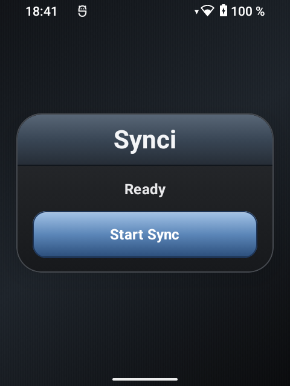
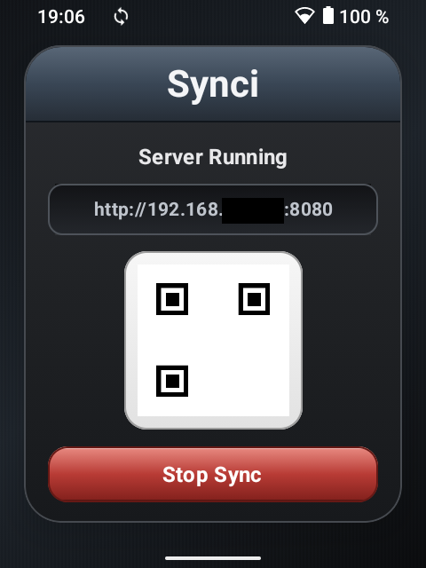
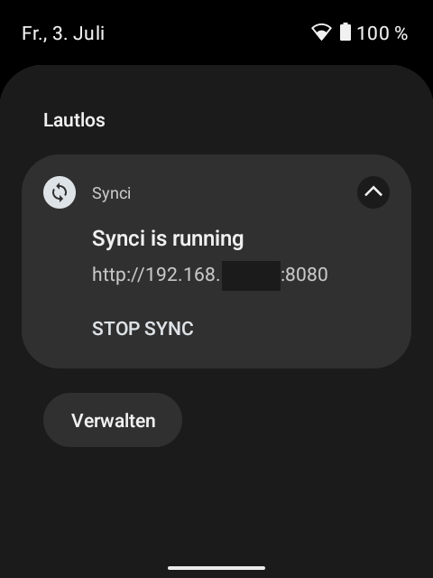
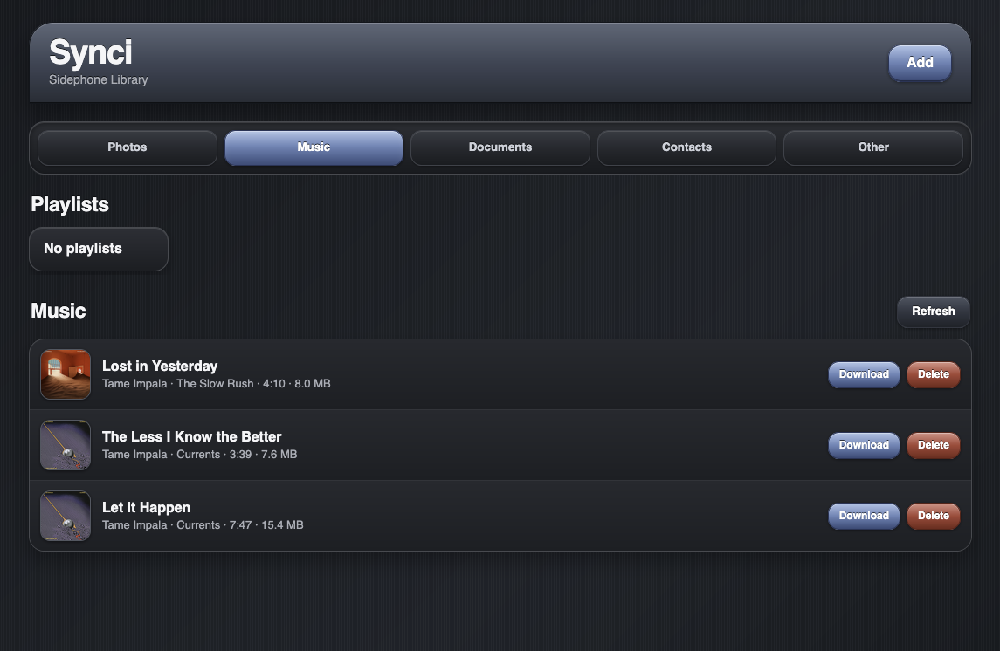
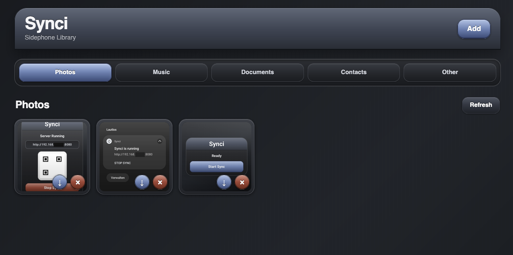

# Synci

A small local sync app for my Sidephone.

Synci starts a tiny web server directly on the Android device and lets me move files between my computer and the Sidephone from a browser on the same network. It is intentionally simple: start the server on the phone, open the shown local URL on another device, then upload, download, or delete files.

> This project was absolutely, unapologetically vibe-coded.  
> It is a personal utility app, built by feeling, iteration, screenshots, and “okay, now make it nicer”.

## What it does

- Starts a local HTTP server on the Sidephone
- Shows the server URL and QR code in the Android app
- Keeps a persistent notification while the server is running
- Provides a browser-based file manager
- Supports separate sections for:
  - Photos
  - Music
  - Documents
  - Contacts
  - Other
- Allows upload by button or drag and drop
- Allows download and delete from the browser UI
- Shows photo previews
- Shows music metadata and album art where available

## Screenshots

### Android app

Start screen:



Running server screen:



Persistent notification:



### Web UI

Music section:



Photos section:



## Screenshot privacy

When publishing screenshots, it is recommended to hide or replace the local IP address.

The address shown by Synci is usually a private LAN address such as:

```text
http://192.168.x.x:8080
```

This is not publicly reachable from the internet in normal home networks, but it can still reveal details about the local network. For public posts, README images, GitHub, Printables, blog posts, or social media, use one of these instead:

```text
http://192.168.xxx.xxx:8080
http://sidephone.local:8080
http://local-device:8080
```

So yes: for public screenshots, blur or replace the IP address.  
For personal notes or private screenshots, it is usually fine to leave it visible.

## Design

The app is styled as a modern dark skeuomorphic utility app — loosely inspired by the glossy, tactile feel of old mobile interfaces, but with a cleaner dark look.

The Android app and the web UI are intentionally matched:
- dark linen-like background
- glossy blue-grey header
- inset panels
- rounded cards
- shiny blue/red action buttons

## Security note

Synci is meant for trusted local networks only.

It does not try to be a hardened public file server. Do not expose it to the internet, do not port-forward it, and do not use it on untrusted public Wi-Fi unless you understand the risk.

## Development

Typical build/install flow:

```bash
./gradlew clean assembleDebug
adb install -r app/build/outputs/apk/debug/app-debug.apk
adb shell monkey -p com.wnderlvst.sidephonesync 1
```

If the launcher icon does not update, uninstall first:

```bash
adb uninstall com.wnderlvst.sidephonesync
adb install -r app/build/outputs/apk/debug/app-debug.apk
```

## Web assets

The browser UI lives in:

```text
app/src/main/assets/web/
```

Main files:

```text
index.html
app.css
app.js
favicon.ico
manifest.webmanifest
```

## Android resources

Launcher icons and notification icons live in:

```text
app/src/main/res/
```

Important icon resources include:

```text
mipmap-anydpi-v26/ic_launcher.xml
mipmap-anydpi-v26/ic_launcher_round.xml
drawable-nodpi/ic_launcher_background.png
drawable-nodpi/ic_launcher_foreground.png
drawable/ic_stat_synci.xml
```

## Current status

Synci is a personal WIP tool. It works well enough for the intended Sidephone workflow, but it is not a polished production app.

Known rough edges may include:
- browser caching during UI changes
- Android launcher icon caching
- permission quirks between Android versions
- delete confirmations for MediaStore files
- local-network availability depending on Wi-Fi state

## License

Personal project. No formal license selected yet.
